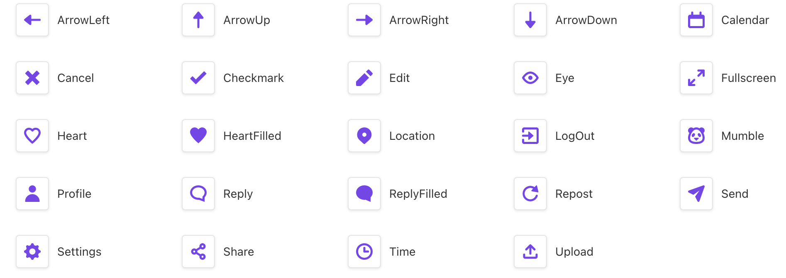

# Musketeer's Design System

Wiki: https://github.com/smartive-education/design-system-component-library-musketeers/wiki

Agile Board (Trello): https://trello.com/b/BK3h5ADR/mumble

## Overview

Musketeers's Design System is a Storybook / Tailwind based React Component Library.
The latest published Storybook version is available here: https://smartive-education.github.io/design-system-component-library-musketeers

## How To Use The Library In Your React/Next.js Project

### Package Installation
In order to make use of this design system you have to follow these setup steps.

### 1. Design System installation

Before we can install the design system package we need to make sure we have the correct authentication setup in order to access the repository.

Setup a .npmrc file in the root of your repository and paste following lines into it.

Replace the {{TOKEN}} with your personal token.

```bash
@smartive-education:registry=https://npm.pkg.github.com
//npm.pkg.github.com/:_authToken={{TOKEN}}
```

This will make the design system available in your repository

```bash
npm install @smartive-education/design-system-component-library-musketeers
```

### 2. Tailwind, Postcss & Autoprefixer installation

The design system is based on tailwind-css and post-css, so in order to make the system work we need to install these packages and set it up properly. 

The tailwind configuration will be described in the next section.

Installs the necessary packages

```bash
npm install -D tailwindcss postcss autoprefixer
```

Sets up tailwind css and generates tailwind.config.js and postcss.config.js

```bash
npx tailwindcss init -p
```

Head to "Tailwind Configuration" section to continue the setup.

### Tailwind Configuration

Since all packages and configuration files are now available we need to load the design system config as a preset into the repository in order to make the design tokens available.

In order to apply the design tokens to our system we need also to specify the content path to our components in the libary.

#### tailwind.config.js

```javascript
/** @type {import('tailwindcss').Config} */
module.exports = {
  presets: [
      // Loads design tokens as presets
    require('@smartive-education/design-system-component-library-musketeers/preset')
  ],
  content: [
      // Specifies content path to our design system components in order to apply design tokens
    './node_modules/@smartive-education/design-system-component-library-musketeers/dist/components/**/*.js',
    "./pages/**/*.{js,ts,jsx,tsx}",
    "./components/**/*.{js,ts,jsx,tsx}",
  ],
}
```

Now you are ready to use the design token from its design system.

### Components usage

After the setup you will be able to use all components from the design system. Import your desired component as followed.

```javascript
import { Component } from '@smartive-education/design-system-component-library-musketeers';
```

Check the available components section to see which components ready for use

#### Usage

Now you can use the components as followed. Check the design system for the correct useage and see what props are available.

```javascript
export default function Home() {
  return (
      <>
        <Component></Component>
        ...
      </>
  )
}
```

#### Available Components
1. avatar
2. button
3. card
4. container
5. file-upload
6. header
7. icon-link
8. input
9. interaction
10. navigation
11. navigation-item
12. profile-image
13. tabs
14. text-link
15. textarea

### SVG Icons

The design system comes with a set of svg icons. The icons are automatically generated into javascript components and can be imported as followed.

```javascript
import { ArrowUp } from '@smartive-education/design-system-component-library-musketeers';
```

The icon name is also the component name and can be used for the import. Here is an example:

```javascript
import { ArrowUp } from '@smartive-education/design-system-component-library-musketeers';

export default function Icon() {
  return (
      <>
        <ArrowUp />
      </>
  )
}
```

#### Available SVG Icons



## Project Development History and Learnings

### Agile Board

This is our Trello Board for this project. We've added a plugin, so every ticket will get an ID which we are refering to for branch names and commit messages.
https://trello.com/b/BK3h5ADR/mumble

### General variable naming conventions

We stay in line with Ketta Naito's Naming Cheat-Sheet. Comprehensive language-agnostic guidelines on variables naming:
https://github.com/kettanaito/naming-cheatsheet

### Branch naming

Our workflow is loosely based on Git-Flow. We have a develop and a main branch. Our feature branches are based on the develop branch.
The pattern for naming a branch is: {ticket-id}-{short}-{topic}-{title}
If there is no ticket, it's possible to use "0" for the id.

### Commit Messages

We base our commit messages on Conventional Commits, which integrates nicely with Semantic Release:

https://www.conventionalcommits.org/en/v1.0.0/

Valid commit subject examples:

"feat: #99 Header component"

"fix: #0 Button type declarations"

"docs: Update readme"

### Releases Notes

Checkout the release notes here: https://github.com/smartive-education/design-system-component-library-musketeers/releases

## General learnings

- Think about using a headless component library from the beginning, if Accessibility support is important
- Adopt the future project file structure early on
- If you plan to work with Typescript, add it in the beginning already
- We went for a SVGR based Icon solution, the advantages with this approach are:
  - Developer Experience: Adding a new icon is just exporting it from Figma to the src/assets/icons folder - that's it. Now the Icon can be used as a React component
  - A lot of control over the React component generation. Custom templates can be used, in our solution we transform the exported Icon color from the Designer automatically to currentColor, this way the color of the icon can be set via tailwind classes
  - Webpack config for the DEV server is one thing, we also needed to add a build step for the icons to expose the icon components for NPM
- Storybook MDX documentation pages
  - Storybook provides some nice helpers for MDX pages
  - We tried to use it as far as possible, as example for the Icons and Colours
  - The issue with this is, that Tailwind CSS classes gets overridden by scoped Storybook styles on MDX pages. So for some pages, like Typography, we needed to stick with the component page setting, even if it's not a documentation page for a component
